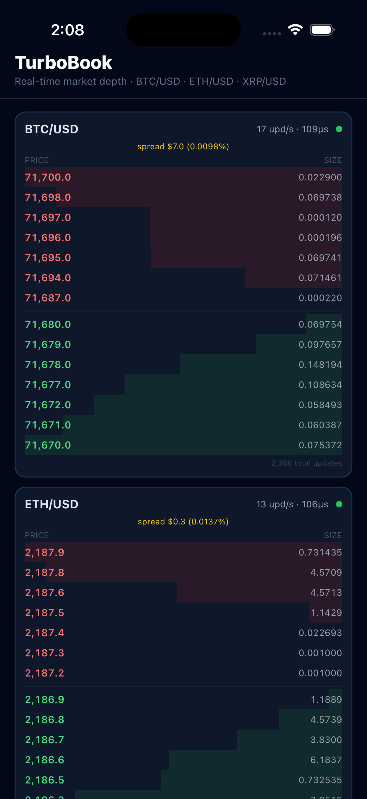

# TurboBook

A real-time cryptocurrency market depth viewer built with React Native, Expo, and a custom C++ TurboModule. Streams live orderbook data from Bitfinex via a single native WebSocket, processing updates in C++ and surfacing them to JS through the React Native New Architecture (JSI).

---

## Screenshot

<p align="center">
  
</p>

---

## Tech Stack

| Layer | Technology |
|-------|-----------|
| Framework | React Native 0.79 + Expo SDK 54 |
| Architecture | New Architecture (Hermes + TurboModules + JSI) |
| Native module | C++ TurboModule via codegen (`RCT_EXPORT_MODULE`) |
| WebSocket | `NSURLSessionWebSocketTask` (native ObjC, not JS) |
| Orderbook engine | `std::map` with O(log n) insert/delete |
| JS bridge | JSI synchronous call — no async bridge overhead |
| Language | TypeScript + C++20 + Objective-C++ |

---

## Architecture

```
Bitfinex WSS
     │
     ▼
NSURLSessionWebSocketTask          ← single native WS connection
     │
     ▼  (background thread)
NativeOrderbookEngine.mm
  ├── chanId → symbol routing
  └── per-symbol C++ OrderbookEngine
        ├── processSnapshot()      ← initial 25-level snapshot
        └── processDelta()         ← price-level deltas
              └── std::map<double, Level>  (bids desc, asks asc)

JS thread (50ms poll via setInterval)
  ├── getTimings(sym)              ← cheap: reads totalUpdates counter
  │     └── dirty? skip render
  └── getTopLevels(sym, depth)     ← JSI synchronous call
        └── flat number[]  [bidCount, askCount, p,c,a,t...]
              └── parsed into OrderbookEntry[] → React state → render
```

### Why a C++ TurboModule?

In a standard React Native app, WebSocket messages arrive on the JS thread. Parsing JSON, maintaining a price-level map, and sorting on every update competes directly with rendering. With a TurboModule:

- The native WS runs on a background thread — the JS thread is never blocked by incoming market data
- A single connection fans out to multiple symbol engines independently
- `getTopLevels()` is a synchronous JSI call (~2–5μs C++ traversal + ~50μs JSI boxing for 7 levels) — no async round-trip

---

## Getting Started

### Prerequisites
- Xcode 15+
- CocoaPods
- Node 18+

### Install
```bash
git clone https://github.com/yourusername/turbobook
cd turbobook
npm install
cd ios && pod install && cd ..
```

### Run
```bash
npx expo run:ios
```

> Requires iOS 16+ (physical device or simulator). The TurboModule is iOS-only.

---

## Project Structure

```
turbobook/
├── app/
│   └── index.tsx                     # Main screen — 3 live orderbook panels
├── lib/
│   ├── orderbook-native.ts           # useMultiOrderbook() hook — polls TurboModule
│   ├── orderbook-engine/
│   │   └── NativeOrderbookEngine.ts  # Codegen TypeScript spec
│   └── orderbook.ts                  # Pure JS reference implementation
└── cpp/
    ├── OrderbookEngine.h/.cpp         # C++ price-level engine (std::map, CRC32)
    ├── NativeOrderbookEngine.mm       # ObjC++ TurboModule implementation
    └── OrderbookEngine.podspec
```

---

## Key Implementation Details

**Dirty-flag polling** — JS polls `getTimings()` every 50ms (cheap scalar read). Only calls `getTopLevels()` (JSI array allocation) when `totalUpdates` has changed. Eliminates wasted renders when the market is quiet.

**Flat array layout** — `getTopLevels()` returns `[bidCount, askCount, price, count, amount, total, ...]` as a single `NSArray<NSNumber *>`. Avoids nested array allocation overhead vs returning objects.

**Exponential backoff** — WS reconnects at 2s → 4s → 8s → 16s → 30s (capped). Resets on any successful subscription to avoid penalising brief disconnects.

**Thread safety** — `NSLock` protects `_engines` and `_stats` shared between the WS receive thread and JS poll thread. `std::shared_ptr` copied under lock so the lock is released before entering C++ (which has its own `std::mutex`).

---

## License

MIT
